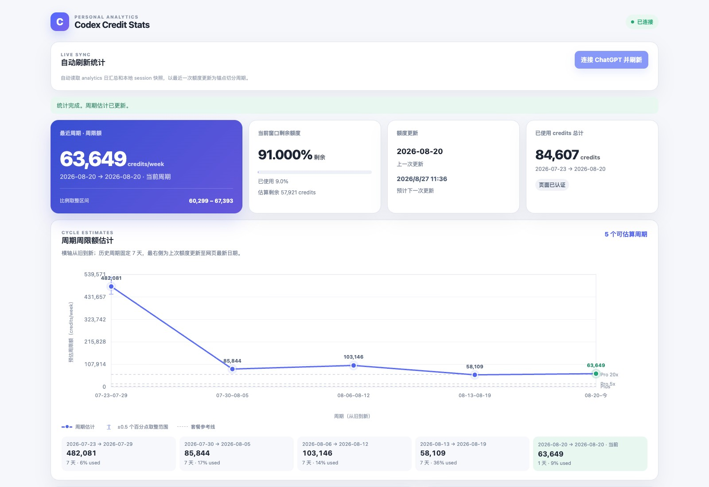

# Codex Credit Stats

[English](README.md) · 简体中文 · [日本語](README.ja.md)



Codex Credit Stats 是一个本地网页工具，用于根据你的实际使用情况估算 Codex 周限额。它会显示每个使用周期的预估周限额、每日 credits 使用量、当前窗口剩余 credits，以及常见套餐的参考额度。

## 为什么必须看 Credits

仅凭 Token 数量或其他间接指标，无法知道每月真实额度。Codex 官方额度界面目前只给出百分比；百分比只能表示相对使用进度，不能告诉你额度本身有多少。**Credits 是查看实际额度最直接、最准确的指标。**

## 安装

**要求**：Node.js 20 或更高版本。

**推荐**：

```bash
npx codex-credit-stats
```

也可以从源码启动：

```bash
git clone https://github.com/szguicheng/codex-credit-stats.git
cd codex-credit-stats
npm install
npm start
```

`npm start` 会在当前终端以前台交互模式持续运行。使用页面时请保持这个终端打开；关闭浏览器不会停止本地服务。再次启动前，请在同一个终端按 `Ctrl+C` 停止服务。如果出现端口冲突，请回到运行上一个实例的终端按 `Ctrl+C`，或使用 `npm start -- --port=4318` 改用其他端口。

工具会在浏览器中打开本地页面。首次使用时点击“连接 ChatGPT 并刷新”；如果尚未登录，请在打开的浏览器窗口中完成 ChatGPT 登录。成功连接后，之后每次启动都会先自动尝试重新连接。

## 用途

这个工具用于帮助你了解当前使用习惯对应的 Codex 周限额。页面会显示：

- 每个七天使用周期的预估周限额；
- 用横向散点连线图对比不同周期；
- 已使用 credits 总计和每日使用明细；
- 当前窗口剩余比例和预估剩余 credits；
- Pro 20x、Pro 5x 和 Plus 套餐的参考额度。

## 工作逻辑

1. 启动本地网页工具，并通过浏览器连接 ChatGPT。
2. ChatGPT 完成认证后，工具从 analytics 页面取得每日使用总量。
3. 工具将每日总量与本地 Codex session 使用记录结合起来。
4. 以历史额度更新点为边界，向前按七天划分周期；从最近一次更新到当前日期的部分作为当前周期。
5. 估算每个周期对应的周限额，并在页面中展示结果。

对于当前窗口，页面会用“当前窗口已使用 credits ÷ 最近一个完整周期的预估周限额”计算已使用比例和剩余比例。若还没有完整的历史周期，则回退到本地 session 快照中的比例。

## 保持连接

首次成功连接后，工具会在本机 `~/.codex-credit-stats/connection.json` 保存一个非敏感的登录连接标记，并复用专用本地浏览器 profile 中的登录状态。之后每次启动时会先自动尝试刷新；如果保存的连接已经失效，自动尝试会结束，连接按钮恢复可用，并提示你重新连接。密码、cookie 和 Authorization token 不会写入项目文件。

## 它会读取哪些信息

工具会读取两类个人信息：

1. **ChatGPT analytics 使用数据** —— ChatGPT analytics 页面返回的每日 Codex credits 使用总量。如果 analytics 返回了套餐名称，也只会用于可选的参考对比。
2. **本地 Codex session 使用数据** —— 本地 Codex session 文件中记录的使用比例和重置时间，通常位于 `~/.codex/sessions`。

这两项信息用于计算预估周限额和当前窗口剩余 credits。
